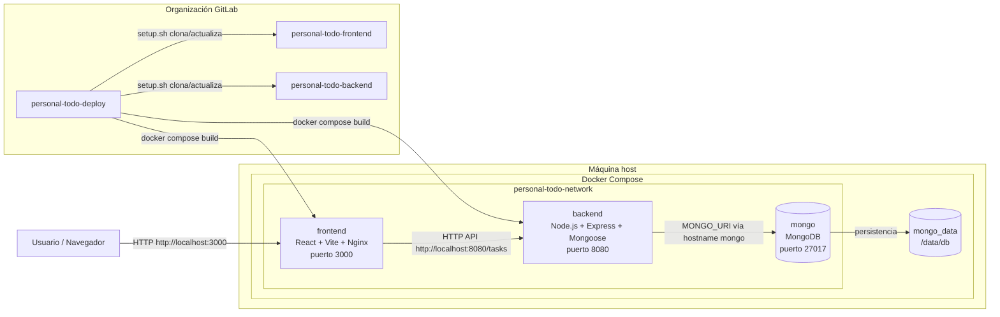

# Personal Todo - Arquitectura

Personal Todo Challenge es una aplicación web para gestionar tareas. La solución está separada en tres repositorios dentro de la organización: frontend, backend y deploy. Esto permite evolucionar la interfaz, la API y la infraestructura local de forma independiente, manteniendo un punto único para levantar todo el sistema con Docker Compose.

## Repositorios

| Repositorio              | Rol            | Contenido principal                                                                                                     |
| ------------------------ | -------------- | ----------------------------------------------------------------------------------------------------------------------- |
| `personal-todo-frontend` | Aplicación web | React, TypeScript, Vite, Axios, React Router y componentes de UI para listar, crear, editar, eliminar y filtrar tareas. |
| `personal-todo-backend`  | API REST       | Node.js, Express, TypeScript, Mongoose, Zod, arquitectura en capas y tests con Jest/Supertest.                          |
| `personal-todo-deploy`   | Orquestación   | `docker-compose.yml`, `setup.sh`, `Makefile`, variables de entorno, seed de datos.                                      |


## Diagrama de arquitectura



## Arquitectura de ejecución

La aplicación se ejecuta localmente con tres servicios Docker conectados por la red `personal-todo-network`.

| Servicio   | Contenedor               | Tecnología                 | Puerto host | Responsabilidad                                           |
| ---------- | ------------------------ | -------------------------- | ----------- | --------------------------------------------------------- |
| `frontend` | `personal-todo-frontend` | React, Vite, Nginx         | `3000`      | Servir la SPA y consumir la API de tareas.                |
| `backend`  | `personal-todo-backend`  | Node.js, Express, Mongoose | `8080`      | Exponer endpoints REST, validar datos y persistir tareas. |
| `mongo`    | `personal-todo-mongo`    | MongoDB                    | `27017`     | Base de datos local para las tareas.                      |

El frontend se compila con Vite y se publica utilizando Nginx. El backend se compila con TypeScript y corre en Node.js. MongoDB persiste los datos en el volumen `mongo_data`.

## Backend

El backend implementa una API REST de tareas con arquitectura en capas y conecta con MongoDB usando Mongoose.

```text
src/
|-- app.ts
|-- server.ts
|-- config/        Configuración de entorno y base de datos
|-- routes/        Rutas HTTP
|-- controllers/   Entrada HTTP y códigos de respuesta
|-- schemas/       Validaciones con Zod
|-- services/      Reglas de aplicación
|-- repositories/  Acceso a datos
|-- models/        Modelos Mongoose
`-- middlewares/   Manejo centralizado de errores
```

La entidad principal es `Task`:

| Campo            | Tipo                                  | Descripción                                |
| ---------------- | ------------------------------------- | ------------------------------------------ |
| `id`             | `string`                              | Identificador expuesto por la API.         |
| `titulo`         | `string`                              | Título requerido de la tarea.              |
| `descripcion`    | `string`                              | Descripción opcional.                      |
| `estado`         | `PENDIENTE \| EN_CURSO \| FINALIZADA` | Estado actual de la tarea.                 |
| `fecha_creacion` | `Date`                                | Fecha de creación generada por el backend. |

Endpoints principales:

| Método   | Ruta         | Uso                                                              |
| -------- | ------------ | ---------------------------------------------------------------- |
| `GET`    | `/tasks`     | Lista todas las tareas. Permite filtrar por `?estado=PENDIENTE`. |
| `GET`    | `/tasks/:id` | Obtiene una tarea por ID.                                        |
| `POST`   | `/tasks`     | Crea una tarea.                                                  |
| `PUT`    | `/tasks/:id` | Actualiza una tarea.                                             |
| `DELETE` | `/tasks/:id` | Elimina una tarea.                                               |

## Frontend

El frontend consume la API REST y muestra una interfaz para gestionar tareas con React y Vite.

```text
src/
|-- api/          Cliente Axios y funciones de tareas
|-- components/   Formulario, lista, item, filtros y contadores
|-- hooks/        useTasks para carga y acciones async
|-- pages/        Página principal de tareas
|-- types/        Tipos compartidos
`-- styles.css
```

Funcionalidades incluidas:

* Listado de tareas.
* Creación de tareas con título, descripción y estado.
* Edición inline.
* Eliminación con confirmación.
* Filtro por estado.
* Contadores por estado.
* Estados de carga y error.

## Contrato entre frontend y backend

El frontend consume la API REST del backend.

La API espera y devuelve tareas con este contrato base:

```json
{
  "id": "665a1f...",
  "titulo": "Aprender Docker Compose",
  "descripcion": "Levantar frontend, backend y MongoDB",
  "estado": "PENDIENTE",
  "fecha_creacion": "2026-05-30T00:00:00.000Z"
}
```

En la UI, esos campos se mapean a `title`, `description`, `status` y `createdAt` para mantener componentes desacoplados del formato del backend.

## Decisiones de arquitectura

* Separar frontend, backend y deploy reduce el acoplamiento entre UI, API e infraestructura.
* Docker Compose permite reproducir el entorno completo con un solo comando.
* MongoDB corre localmente para simplificar pruebas y demos sin depender de servicios externos.
* El backend concentra validaciones con Zod y persistencia con Mongoose.
* El frontend encapsula el acceso HTTP en `api/` y centraliza el estado de tareas en `useTasks`.
